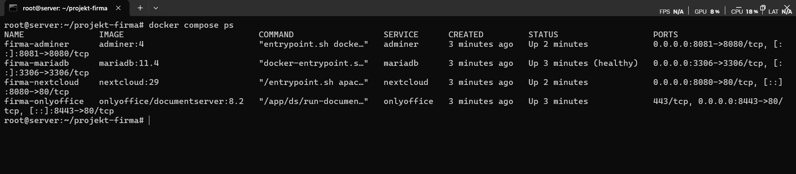
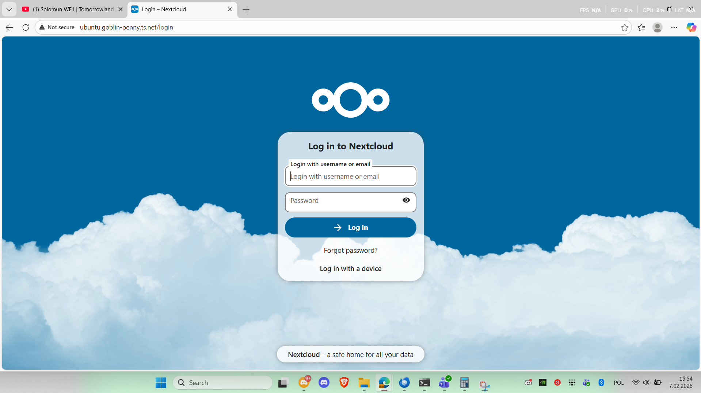
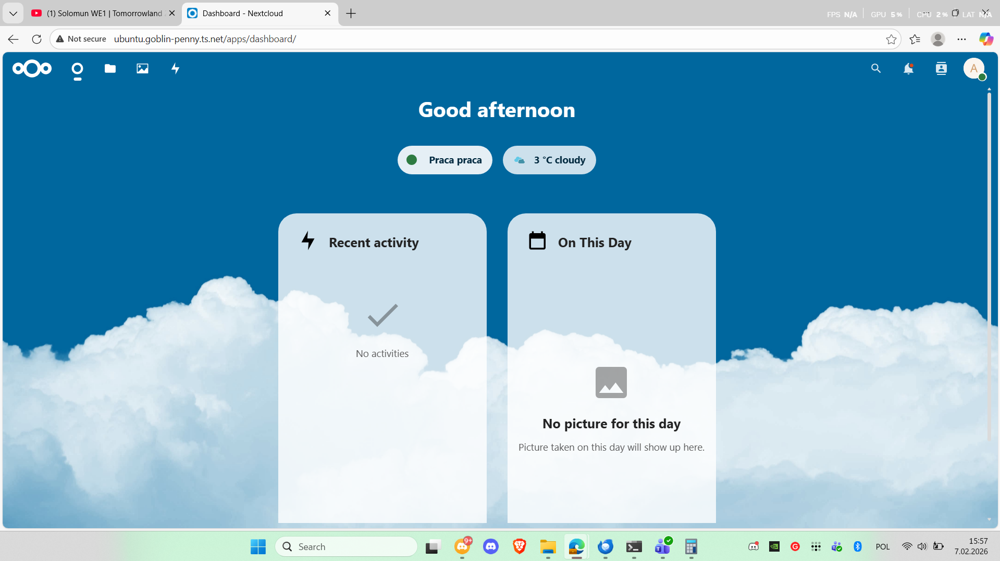
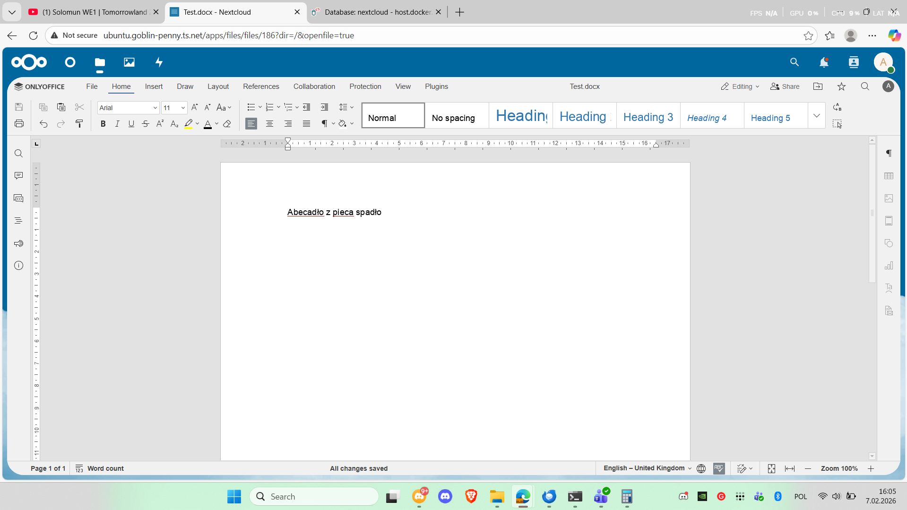
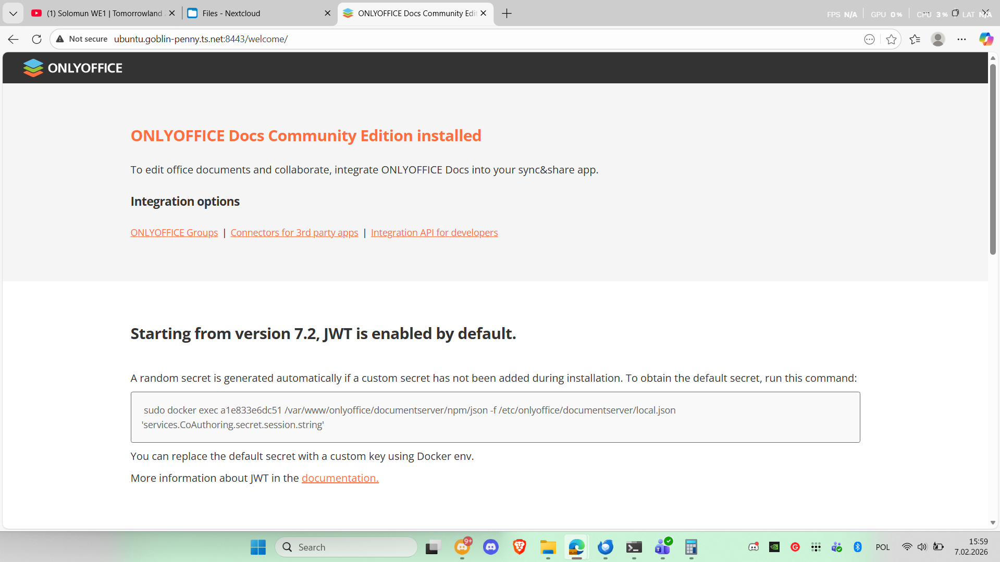
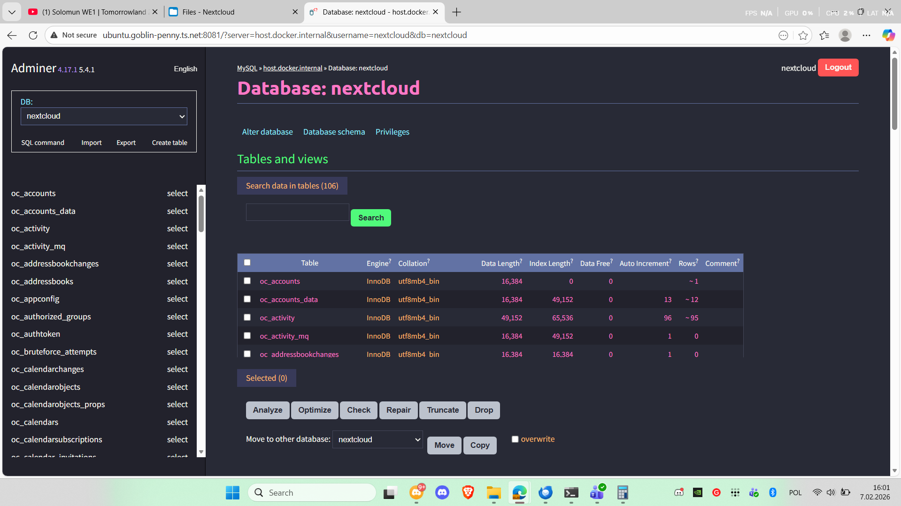

# System zarządzania małą firmą

## Projekt zaliczeniowy – Konteneryzacja i orkiestracja usług IT

**Autor:** Marek Bogacki 7812
**Data:** 07.02.2026

---

## 1. Opis projektu

Kompletny system zarządzania małą firmą oparty na architekturze wielokontenerowej. System umożliwia:

- **Przechowywanie i współdzielenie dokumentów** (Nextcloud)
- **Edycję dokumentów online** (OnlyOffice)
- **Trwałe przechowywanie danych** (MariaDB)
- **Zarządzanie bazą danych przez interfejs webowy** (Adminer)

Całość jest dostępna zdalnie przez prywatną sieć **Tailscale** pod adresem `ubuntu.goblin-penny.ts.net`.

---

## 2. Architektura systemu


**Przepływ komunikacji:**

- Użytkownik łączy się z Nextcloud przez przeglądarkę (port 8080)
- Gdy otwiera dokument Office, Nextcloud przekazuje go do OnlyOffice (port 8443)
- OnlyOffice pobiera plik z Nextcloud po wewnętrznej sieci Docker (http://nextcloud/)
- Nextcloud przechowuje metadane w MariaDB (port 3306)
- Adminer łączy się z MariaDB do celów administracyjnych

---

## 3. Wdrożone usługi

| Usługa | Obraz Docker | Port | Rola |
|--------|-------------|------|------|
| **Nextcloud** | `nextcloud:29` | 8080 | Zarządzanie dokumentami, kalendarzami, kontaktami |
| **OnlyOffice** | `onlyoffice/documentserver:8.2` | 8443 | Edycja dokumentów online|
| **MariaDB** | `mariadb:11.4` | 3306 | Relacyjna baza danych dla Nextcloud |
| **Adminer** | `adminer:4` | 8081 | Lekki interfejs webowy do zarządzania bazą danych |

---

## 4. Wymagania

### Oprogramowanie

- **System operacyjny:** Linux (Ubuntu 22.04+)
- **Docker Engine:** wersja 24.0+ z pluginem Docker Compose
- **Tailscale: (zalecany)** skonfigurowany i połączony z siecią
- **RAM:** minimum 4 GB
- **Dysk:** minimum 5 GB wolnego miejsca

### Sprawdzenie wersji

```bash
docker --version
docker compose version
tailscale status
```

## 5. Struktura plików

```bash
projekt-firma/
├── docker-compose.yml
├── .env
├── nextcloud-onlyoffice.sh
└── README.md
```

## 6. Pliki konfiguracyjne

### 6.1. Plik .env

```bash
# === Baza danych MariaDB ===
MYSQL_ROOT_PASSWORD=SuperTajneHasloRoot123!
MYSQL_DATABASE=nextcloud
MYSQL_USER=nextcloud
MYSQL_PASSWORD=NextcloudHaslo456!

# === Nextcloud ===
NEXTCLOUD_ADMIN_USER=admin
NEXTCLOUD_ADMIN_PASSWORD=AdminFirma789!

# === OnlyOffice ===
JWT_SECRET=MojSekretnyKluczJWT2024!

# === Tailscale ===
TAILSCALE_DOMAIN=ubuntu.goblin-penny.ts.net
```
### 6.2. Plik docker-compose.yml
```YAML
services:
  mariadb:
    image: mariadb:11.4
    container_name: firma-mariadb
    restart: unless-stopped
    environment:
      MYSQL_ROOT_PASSWORD: ${MYSQL_ROOT_PASSWORD}
      MYSQL_DATABASE: ${MYSQL_DATABASE}
      MYSQL_USER: ${MYSQL_USER}
      MYSQL_PASSWORD: ${MYSQL_PASSWORD}
    volumes:
      - mariadb_data:/var/lib/mysql
    ports:
      - "3306:3306"
    networks:
      - firma_network
    healthcheck:
      test: ["CMD", "healthcheck.sh", "--connect", "--innodb_initialized"]
      interval: 10s
      timeout: 5s
      retries: 10
      start_period: 30s
    command: >
      --transaction-isolation=READ-COMMITTED
      --log-bin=binlog
      --binlog-format=ROW
      --innodb-file-per-table=1
      --skip-innodb-read-only-compressed
  nextcloud:
    image: nextcloud:29
    container_name: firma-nextcloud
    restart: unless-stopped
    depends_on:
      mariadb:
        condition: service_healthy
    environment:
      MYSQL_HOST: host.docker.internal
      MYSQL_DATABASE: ${MYSQL_DATABASE}
      MYSQL_USER: ${MYSQL_USER}
      MYSQL_PASSWORD: ${MYSQL_PASSWORD}
      NEXTCLOUD_ADMIN_USER: ${NEXTCLOUD_ADMIN_USER}
      NEXTCLOUD_ADMIN_PASSWORD: ${NEXTCLOUD_ADMIN_PASSWORD}
      NEXTCLOUD_TRUSTED_DOMAINS: localhost
      PHP_MEMORY_LIMIT: 1024M
      PHP_UPLOAD_LIMIT: 10G
    volumes:
      - nextcloud_data:/var/www/html
    ports:
      - "8080:80"
    extra_hosts:
      - "host.docker.internal:host-gateway"
    networks:
      - firma_network

  onlyoffice:
    image: onlyoffice/documentserver:8.2
    container_name: firma-onlyoffice
    restart: unless-stopped
    environment:
      JWT_SECRET: ${JWT_SECRET}
      JWT_ENABLED: "true"
    volumes:
      - onlyoffice_data:/var/www/onlyoffice/Data
      - onlyoffice_logs:/var/log/onlyoffice
    ports:
      - "8443:80"
    networks:
      - firma_network

  adminer:
    image: adminer:4
    container_name: firma-adminer
    restart: unless-stopped
    depends_on:
      mariadb:
        condition: service_healthy
    environment:
      ADMINER_DEFAULT_SERVER: host.docker.internal
      ADMINER_DESIGN: dracula
    ports:
      - "8081:8080"
    extra_hosts:
      - "host.docker.internal:host-gateway"
    networks:
      - firma_network

volumes:
  mariadb_data:
    name: firma_mariadb_data
  nextcloud_data:
    name: firma_nextcloud_data
  onlyoffice_data:
    name: firma_onlyoffice_data
  onlyoffice_logs:
    name: firma_onlyoffice_logs

networks:
  firma_network:
    name: firma_network
    driver: bridge
```
# 7. Instrukcja uruchomienia
### 7.1. Przygotowanie plików
```Bash
mkdir ~/projekt-firma
cd ~/projekt-firma

# Utwórz pliki .env, docker-compose.yml i nextcloud-onlyoffice.sh
# zgodnie z sekcją 6 dokumentacji

chmod +x nextcloud-onlyoffice.sh
```
### 7.2. Uruchomienie kontenerów
```Bash
docker compose up -d
```
Oczekiwany wynik:
```text

[+] Running 9/9
 ✔ Network firma_network        Created
 ✔ Volume firma_mariadb_data    Created
 ✔ Volume firma_nextcloud_data  Created
 ✔ Volume firma_onlyoffice_data Created
 ✔ Volume firma_onlyoffice_logs Created
 ✔ Container firma-mariadb      Healthy
 ✔ Container firma-onlyoffice   Created
 ✔ Container firma-nextcloud    Created
 ✔ Container firma-adminer      Created
```
### 7.3. Konfiguracja integracji OnlyOffice
Skrypt automatycznie czeka na gotowość wszystkich usług:
```Bash
./nextcloud-onlyoffice.sh
```
Oczekiwany wynik:
```text
===========================================
  Konfiguracja Nextcloud + OnlyOffice
===========================================

[1/6] Czekam na MariaDB...
mysqld is alive
  ✓ MariaDB gotowa
[2/6] Czekam na Nextcloud (to może potrwać 1-2 minuty)...
  ✓ Nextcloud gotowy
[3/6] Czekam na OnlyOffice (ten startuje najdłużej ~2-3 min)...
  ✓ OnlyOffice gotowy
[4/6] Konfiguruję trusted domains...
  ✓ Trusted domains OK
[5/6] Instaluję aplikację OnlyOffice w Nextcloud...
onlyoffice 9.8.0 installed
onlyoffice enabled
  ✓ Aplikacja zainstalowana
[6/6] Konfiguruję połączenie z serwerem dokumentów...
  ✓ Połączenie skonfigurowane

===========================================
  GOTOWE!
===========================================

  Nextcloud:  http://ubuntu.goblin-penny.ts.net:8080
  OnlyOffice: http://ubuntu.goblin-penny.ts.net:8443
  Adminer:    http://ubuntu.goblin-penny.ts.net:8081

  Login:  admin
  Hasło:  AdminFirma789!
```

### 7.4. Adresy dostępowe (z dowolnego urządzenia w sieci Tailscale)

| Usługa | Adres | Dane logowania |
|--------|-------|----------------|
| **Nextcloud** | `http://ubuntu.goblin-penny.ts.net:8080` | **Login:** `admin`<br>**Hasło:** `AdminFirma789!` |
| **OnlyOffice** | `http://ubuntu.goblin-penny.ts.net:8443` | **Typ:** Serwer API<br>**Uwaga:** Brak bezpośredniego logowania - integracja przez Nextcloud |
| **Adminer** | `http://ubuntu.goblin-penny.ts.net:8081` | **System:** `MySQL`<br>**Serwer:** `host.docker.internal`<br>**Użytkownik:** `nextcloud`<br>**Hasło:** `NextcloudHaslo456!`<br>**Baza danych:** `nextcloud` |

# 8. Napotkane problemy i rozwiązania

### 8.1 OnlyOffice – błąd pobierania dokumentów
**Problem:** Po otwarciu dokumentu w OnlyOffice pojawiał się błąd "Download failed" – OnlyOffice nie mógł pobrać pliku z Nextcloud.

**Rozwiązanie:** Konieczne było ustawienie trzech parametrów:

- overwrite.cli.url na http://nextcloud – żeby Nextcloud generował poprawne wewnętrzne URLe
- overwritehost na ubuntu.goblin-penny.ts.net:8080 – żeby zewnętrzne URLe wskazywały na Tailscale
- verify_peer_off na true – wyłączenie weryfikacji certyfikatu (komunikacja HTTP)

### 8.2. Nextcloud – "Access through untrusted domain"
**Problem:** Po wejściu na Nextcloud przez adres Tailscale wyświetlał się błąd o niezaufanej domenie.

**Rozwiązanie:** Dodanie domeny Tailscale do trusted_domains przez narzędzie occ:
```Bash

docker exec -u www-data firma-nextcloud php occ config:system:set \
    trusted_domains 1 --value="ubuntu.goblin-penny.ts.net"
```

# 9. Screeny z działającego systemu
### Rys. 1 – Uruchomienie i status kontenerów



### Rys. 2 – Strona logowania Nextcloud



### Rys. 3 – Dashboard Nextcloud po zalogowaniu



### Rys. 4 – Edycja dokumentu w OnlyOffice



### Rys. 5 – OnlyOffice Document Server



### Rys. 6 – Panel Adminer z widokiem bazy danych



---

# 10. Zarządzanie systemem
Podstawowe komendy:
```Bash

# Status kontenerów
docker compose ps

# Zatrzymanie (dane zachowane w wolumenach)
docker compose down

# Ponowne uruchomienie
docker compose up -d

# Restart pojedynczego kontenera
docker compose restart nextcloud

# Podgląd logów na żywo
docker compose logs -f nextcloud

# Wejście do kontenera (shell)
docker exec -it firma-nextcloud bash

# UWAGA: to kasuje WSZYSTKIE dane!
docker compose down -v
```